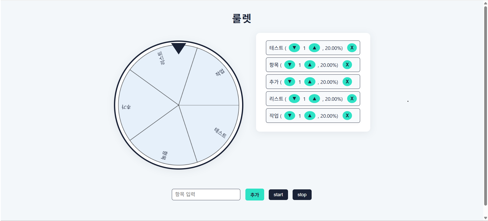

# 📌 프로젝트명: [룰렛 이벤트]
    스트리머들이 이용 가능한 룰렛 생성
    트위치 한국에서 철수하기 이전 시절 존재했던 확률 세부조정과 룰렛 항목까지 사용자가 조정 가능한 룰렛 구현현


---

## 📆 프로젝트 기간

- 시작일: 2025.07.09
- 종료일: 2025.07.21

---

## 🎯 주요 목표

- ✅ [핵심 기능1: 룰렛 기능 구현현]
- ✅ [핵심 기능2: 확률 세부조정 가능]
- ✅ [핵심 기능3: 룰렛 항목 입력 및 수정, 삭제 기능 구현]

---

## ⚙️ 사용 기술 스택

| 분류     | 기술명                            |
|--------|----------------------------------|
| 프론트엔드 | HTML, CSS, JavaScript |

---

## 🧱 프로젝트 구조

```bash
📁 Roulette/
├── Roulette.html # 룰렛 틀 생성성
├── style.css # 스타일 설정
├── act.js # 룰렛 기능 구현현
└── README.md
```

---

## 💡 주요 기능 설명

### ✨ 기능 1: \[룰렛 기능 구현]

* 초기값 상태에선 빈 룰렛이 나오고, 사용자 입력에 따라 항목이 룰렛에 출현하도록 구현

### ✨ 기능 2: \[룰렛 이벤트 기능]

* 룰렛 항목 수량 조절 버튼
* Enter키로 항목 추가 가능

### ✨ 기능 3: \[룰렛 구동 기능]

* Start 버튼과 Stop 버튼으로 룰렛의 시작과 끝 동작 가능능
* 당첨된 항목 팝업으로 띄우기기

---

## 🖼️ 데모 화면

| 주요 화면 | 캡처                     |
| ----- | -------------------------- |
| 예시 화면  |  |


---

## 🧠 회고 요약

* 어려웠던 점: \[회전 후 서서히 멈추게 만드는 기능 구현]
* 배운 점: \[룰렛 항목별 수량 조절하는 방법]
* 개선하고 싶은 점: \[ex. UI 디자인을 좀 더 세련되게 바꾸고 싶음]

---

## 🙋‍♀️ 개발자

| 이름  | GitHub                                           |
| --- | ------------------------------------------------ |
| 문승연 | [github.com/SeanMoon1](https://github.com/SeanMoon1) |
